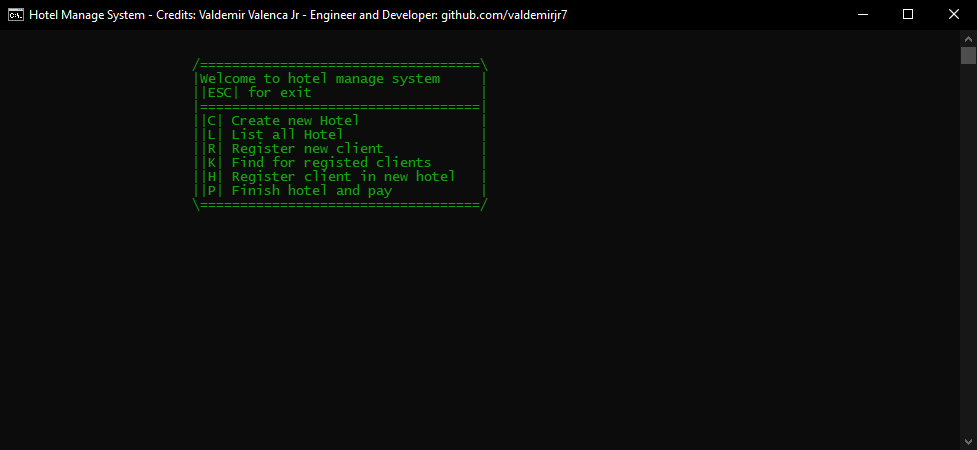

# Hotel Manage System
<h1 align="center">
    
</h1>

## 📋 Indice 

- [About](#-about)
- [Created in Cplusplus](#-created-in-cplusplus)
- [How download project and run](#-how-download-project-and-run)

## 📖 About

The **hotel manage system** is a simple system making in **Cplusplus** for manage your hotel with a good controller system of
hosting creation, register clients and the controller for each hosting registed, is easy for use.

## ⚒ Created in Cplusplus

This system was created in **Cplusplus** with no framework using and a GUI is a pure of terminal system for manage.

## 🛠 How download project and run

For download project is simple

``` bash 

    $ git clone https://github.com/Valdemirjr7/Hotel-Manage-System.git

    $ cd Hotel-Manage-System

```

and ready, you download the system, for compile you will need of a IDE.

Thank you so much for read.

Credits: Valdemir Valenca Jr.
